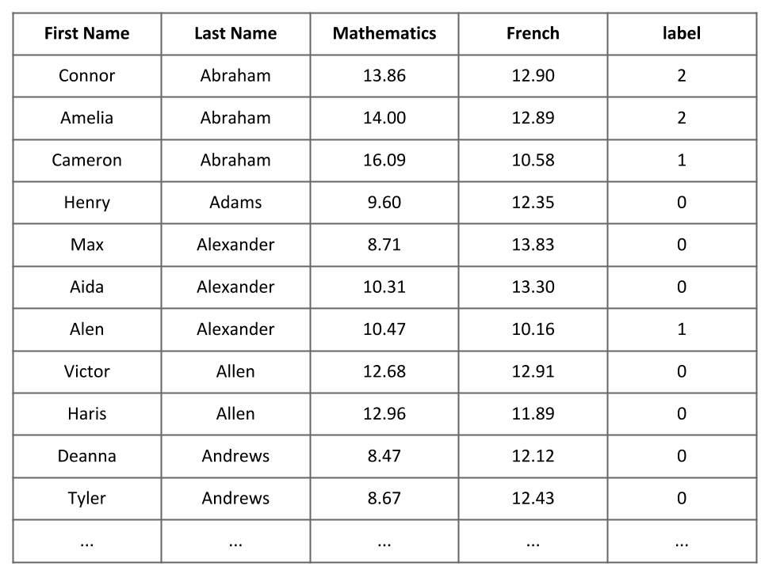
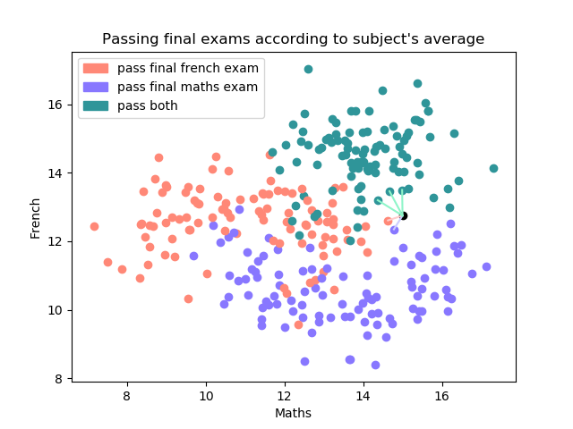
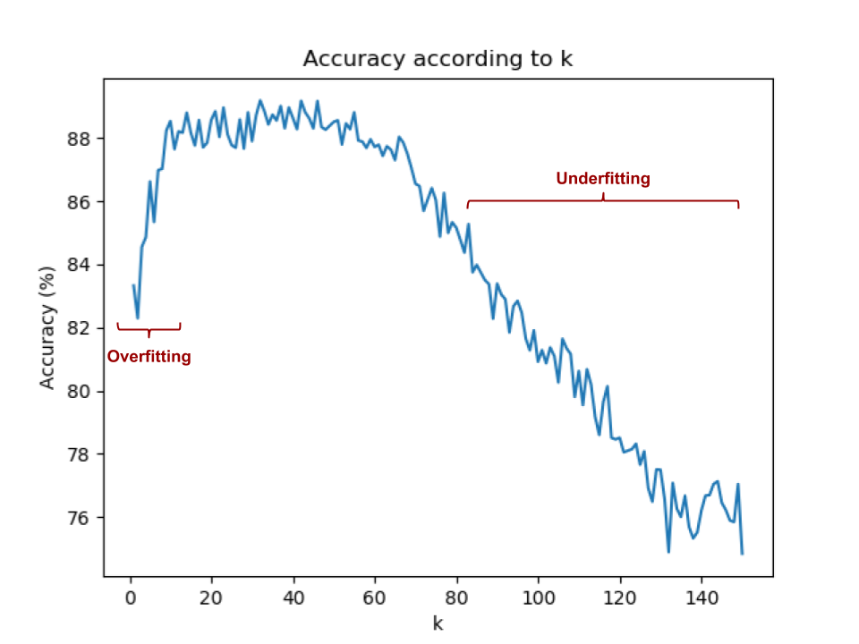

## An easy example

### Predicting the final exam, which will be passed

To illustrate the K-nearest neighbors (KNN) algorithm I will take an easy example. Easy means with only 2 dimensions. By this way, we will be able to display on graphs without reducing the dimensions. It will be more pleasant to look at and therefore to interpret.

In this case, we have a dataset of maths and french subjects average for 300 french students on the year 2018. We also know what final exam they passed (Assuming there are only the maths ant the french final exam at the end of the year and that each student pass at least one of them). The goal of the KNN algorithm here is to predict what final exam a student of the next promotion will pass according to its maths and french average.
The dataset is a .csv file and its associated spreadsheet is represent below. As you can see the last column is for the label. The label is for the classification. The 0, 1 and 2 respectively mean that the student pass the french exam, pass the maths exam and pass both.


### K-nearest neighbors principle

The KNN algoritmh is a method used for classification or regression. It consists of find the k nearest training examples in the feature space. In our example the training examples are the french students and their features are their maths and fench average. As I said there are two cases : 
* Classification : the output is a class. In our example the KNN is for classification and the output is one of the three classes (pass the french exam, pass the maths exam and pass both). The KNN algorithm finds the k closest training examples and the output is the class, which is majoritary in those k neighbors. 
* Regression : the output is a property value. The KNN algorithm finds the k closest training examples and the output is the average of property value of interest of the k neighbors.


In both method we can assign a ponderation to each neihgbors. As an example we can ponderate a neighbor in an inversely proportionnal way to the its distance.


### KNN in our problem

To predict what exam a student will pass according to its averages and the training examples we will not use a ponderation according to the distances of the neighbors. As you may have understood, it is a KKN classification method here. A graph of the training point is shown below. Each student is represented as a point on a graph. This point has a x-coordinate according to its maths average and a y-coordinate according to its french average. The color of the training points means :
* Red : pass the final french exam
* Blue : pass the final maths exam
* Green : pass both

So for a new student (represented as a black point), who has averages of 15 in maths and 12.75 in french, the 5-nearest neighbors are 3 green points, 1 red point and 1 blue point. Therefore 5-NN algorithm classify this student as a green point even if the blue point and the red points are closest than the green ones. So it predicts that this student will pass the two exams.



I choose a k = 5 in my example but how can we choose the k value ? 

To choose the best k value the easier method is to test, which k value will has the best accuracy, for a range of k. In practice, the perfect k value does not exists. Especially since the data are condensed. It is impossible to reach a 100% accuracy for a k value. I ran 100 tests for each k from 1 to 150 as shown below. The bests k are between 10 and 40. This selection method limits : 
* Overfitting : the predictive model will capture all the details that describe the data in the training set. In this case, it will capture all the fluctuations and the random variations of the training set data. In other words, the predictive model will capture the generalizable correlations AND the noise produced by the data. 

As an example, for k < 3, the model is too specialized on the training set data and will not be well generalized to other given data

* Underfitting : the predictive model can't even capture the correlations of the training set. As a result, the cost of error in the learning phase stays high.  Of course, the predictive model be well generalized to other given data.

As an example for k > 80



## Pseudo Code

```
import the dataset

```


## Let's start with python

### Imports
```python 
```
### Variables
```python 
```
### Dataset
```python 
```
### KNN

```python 
```
### Choose K
```python 
```
### not really accurate because of the data. We will try with an other dataset ;)
```python 
```
